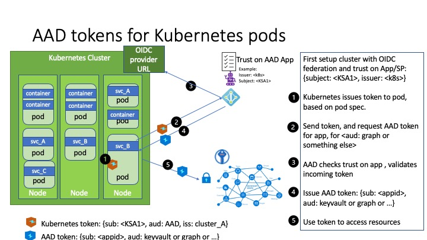

# How it works
In this model, the Kubernetes cluster becomes a token issuer, issuing tokens to Kubernetes Service Accounts. These service account tokens can be configured to be trusted on Azure AD applications or user-assigned managed identities. Workload can exchange a service account token projected to its volume for an Azure AD access token using the Azure Identity SDKs or the Microsoft Authentication Library (MSAL).

## OpenID Connect Issuer

With the Kubernetes cluster acting as a token issuer, Azure Active Directory (AAD) leverages OpenID Connect (OIDC) to discover public signing keys and verify the authenticity of the service account token before exchanging it for an AAD token. Your workload can then consume the AAD token to access Azure cloud resources via the Azure Identity SDKs or the Microsoft Authentication Library (MSAL).

## Service Account

“A service account provides an identity for processes that run in a Pod.”

Azure AD Workload Identity supports the following mappings:

one-to-one (a service account referencing an AAD object)
many-to-one (multiple service accounts referencing the same AAD object).
one-to-many (a service account referencing multiple AAD objects by changing the client ID annotation).