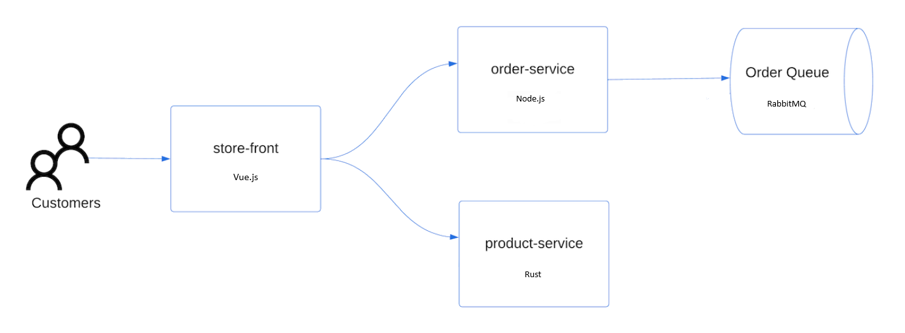

# Setup the lab environment
- Create the following resources
    - Azure Log Analytics Workspace
    - Graphana
    - Application Insights
    - Key Vault
    - User Assigne Managed Identity
    - Azure Container Registry

# Create the AKS
# Setup Monitoring
Monitoring and logging are essential for maintaining the health and performance of your AKS cluster. AKS provides integrations with Azure Monitor for metrics and logs. Logging is provided by container insights which can send container logs to Azure Log Analytics Workspaces for analysis. Metrics are provided by Azure Monitor managed service for Prometheus which collects performance metrics from nodes and pods and allows you to query using PromQL and visualize using Azure Managed Grafana.

# Deploy a demo Application (e-commerce)

# Check the graphana dashboards and Azure Monitor.

# Istio Service Mesh on AKS

Istio is an open-source service mesh that layers transparently onto existing distributed applications. Istio’s powerful features provide a uniform and more efficient way to secure, connect, and monitor services. Istio enables load balancing, service-to-service authentication, and monitoring – with few or no service code changes. Its powerful control plane brings vital features, including:

- Secure service-to-service communication in a cluster with TLS (Transport Layer Security) encryption, strong identity-based authentication, and authorization.
- Automatic load balancing for HTTP, gRPC, WebSocket, and TCP traffic.
- Fine-grained control of traffic behavior with rich routing rules, retries, failovers, and fault injection.
- A pluggable policy layer and configuration API supporting access controls, rate limits, and quotas.
- Automatic metrics, logs, and traces for all traffic within a cluster, including cluster ingress and egress.

## What is an Istio Ingress Gateway?
An Ingress Gateway is an Istio-managed entry point that:

✅ Controls incoming traffic from the internet.

✅ Can enforce security, rate limiting, and routing rules.

✅ Works like a Kubernetes Ingress but provides more flexibility.

## Difference Between External and Internal Istio Ingress Gateways
 

### Overview
Istio uses an Ingress Gateway to control inbound traffic flows for services within an Istio service mesh. Depending on your environment and security needs, you can configure Ingress Gateways to either accept traffic from the public internet (external) or from internal, private networks (internal).

### External Ingress Gateway
- Receives traffic from outside the cluster (public internet).
- Often assigned a publicly accessible IP or host name.
- Protects and routes requests from external clients into services within the mesh.
- Typically configured with stricter security and rate-limiting policies to handle untrusted traffic sources.

### Internal Ingress Gateway
- Handles traffic originating from private networks or trusted internal sources.
- Does not have a public IP or publicly resolvable host name.
- Used for cases where services or clients exist in a separate internal network, data center, or private cloud environment.
- Often configured for more streamlined authentication and authorization, as traffic is generally considered more trusted than external traffic.